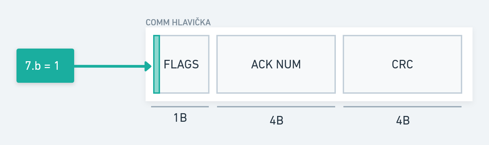
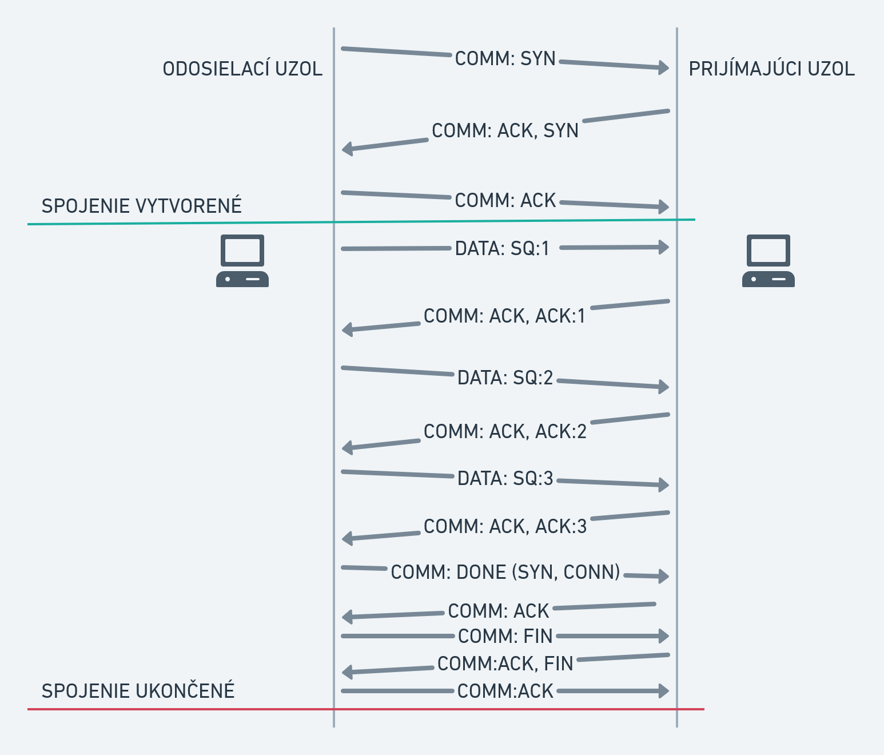
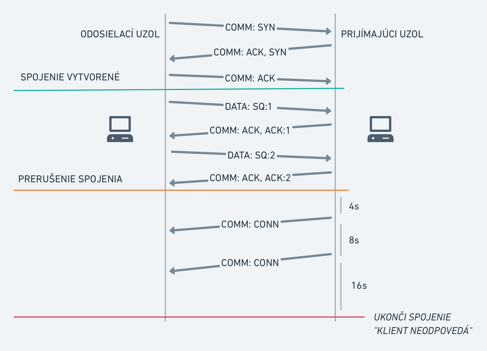
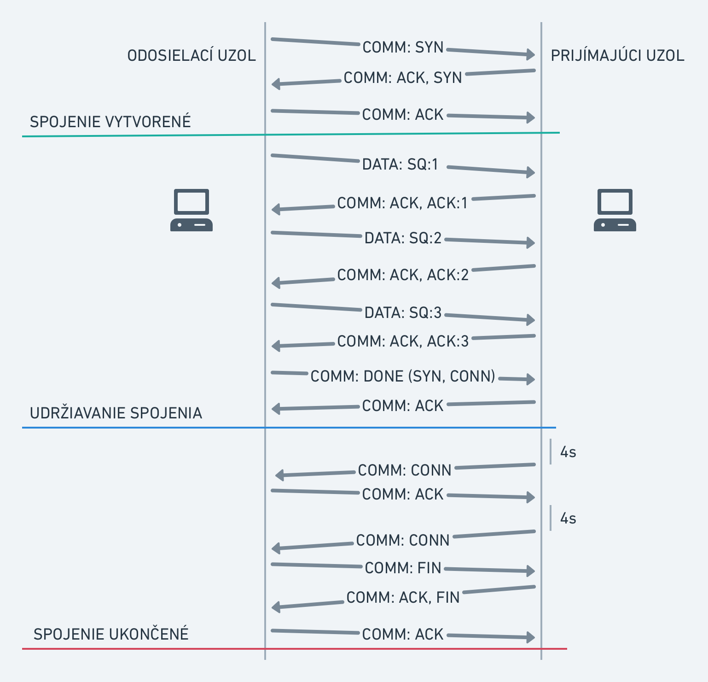
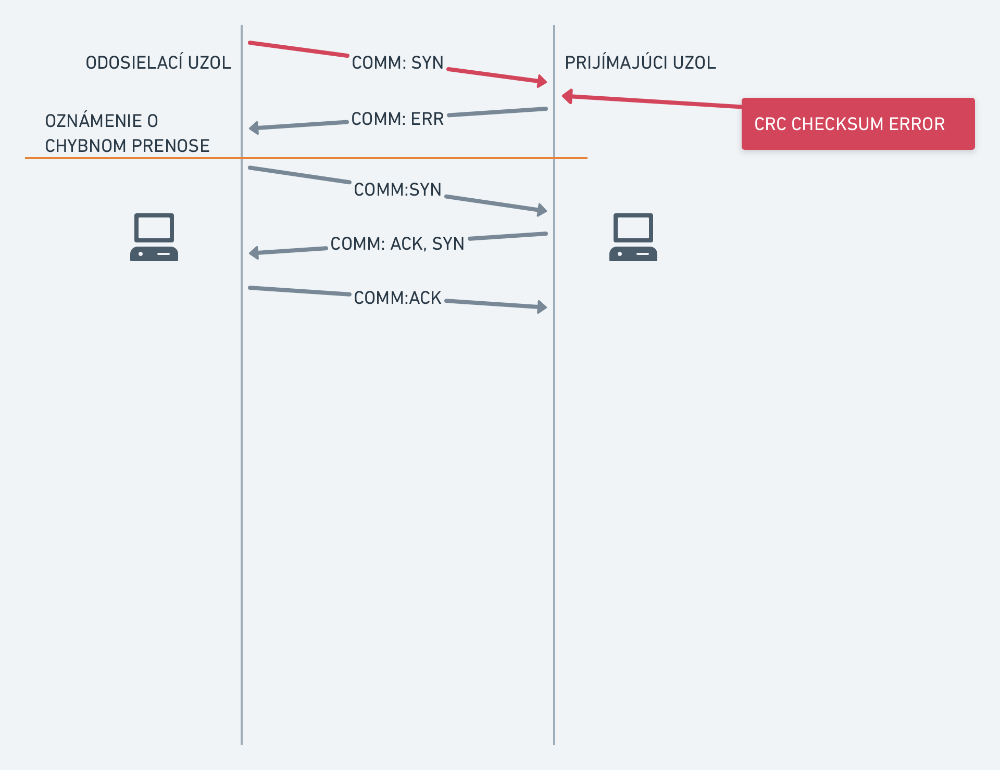
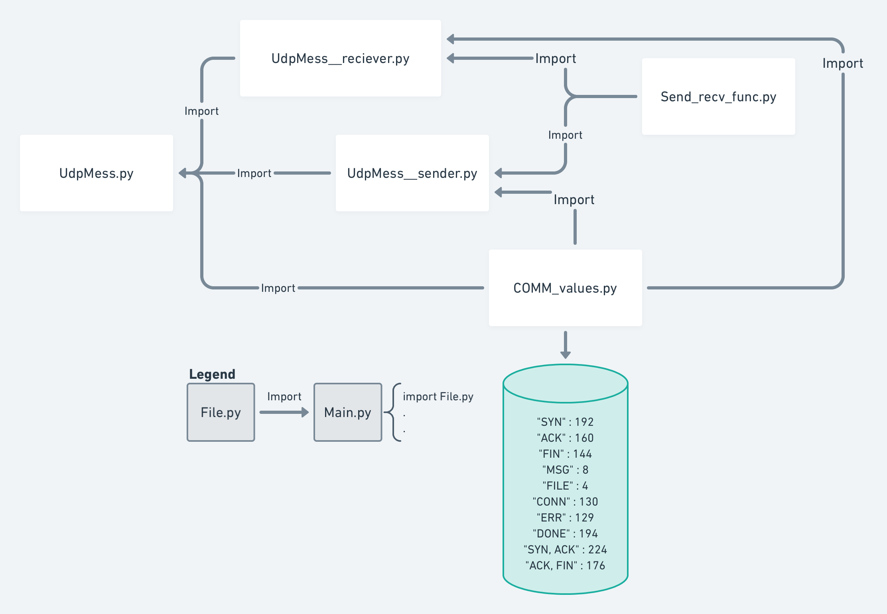

# Assignment documentation No. 2

Computer and communication networks WS 2020/2021

FIIT STU

# Protocol design over UDP and implementation

Author: Oliver Udvardi

Exercises: Thursday 8:00

---

# Protocol design over UDP

In this section, we present the original design, which we used for the implementation

## Header and description of the COMM segment



The following data is found in the individual parts of the header:

1. **FLAGS**: Contains communication flags that serve to ensure confirmation that we have transmitted the data correctly. Depending on which bits are active, we distinguish the following FLAGS - *Table for sending FLAGS*
2. **ACK NUM**: Contains the number to which the frame is being responded to.
3. **CRC**: Cyclic Redundancy Check Checksum - A checksum of the fragment to check whether the data has been corrupted during transmission.

### COMM segment functions

1. Establishing a connection
2. Providing feedback on receiving data
3. Verifying whether the connection is active
4. Maintaining the connection
5. Terminating the connection

.png)

Table for sending FLAGS

## Segment DATA header and description

.png)

Segments in which we send specific data already contain the above-mentioned header at the beginning. The header contains the following parts:

1. **FLAGS**: They are evaluated in the same way as for the COMM segment
2. **LENGTH:** contains the size of the data part (theoretically, $2^9$ would be enough, but in the header we round all sizes to Bytes)
3. **SQ NUM**: Contains the number of the sent segment. Within one communication, the next segment always takes on a value one higher. If a new connection is created, the value is set to the initialization value (depending on the implementation).
4. **CRC**: Cyclic Redundancy Check Checksum - Checksum of the fragment to check whether the data was damaged during transmission.
5. **DATA**: Specifically transmitted bits of the message or file. We define the maximum fragment size at 497B based on RFC1122:

    > In general, no host is required to accept an IP datagram larger than 576 bytes (including header and data), so a host must not send a larger datagram without explicit knowledge or prior arrangement with the destination host.
    >

    *— source, page 59: [https://tools.ietf.org/html/rfc1122#page-58](https://tools.ietf.org/html/rfc1122#page-58)* 

    It follows that if we subtract the headers of lower layer protocols from 576 bytes (B), we can work with a segment size of 508B and after subtracting the headers of all DATA segment header fields, we are left with a DATA fragment size of 497B.

### How to distinguish COMM segments from DATA segments

Since we have two types of headers, we need a way to distinguish them from each other. This is ensured by the first bit of the header, which is set to 1 if the segment with the `COMM` header is sent and 0 if the segment with the `DATA` header is sent

## Calculating CRC Checksum

To check whether the data has not been corrupted during transmission, we use a Cyclic redundancy check type 32 checksum.

1. Before sending the segment, a checksum is calculated, which is stored in the **CRC** section.
2. When a node receives any segment, it recalculates the checksum and if it matches the value in the **CRC** field of the received segment, the frame is processed further, otherwise it is discarded and the node sends back a COMM(ERR) packet.

When calculating the CRC, we calculate the CRC separately for the header and separately for the data, these values ​​are combined into one by an XOR operation (or another).

The pseudocode for calculating CRC32 is given below:


```cpp
Function CRC32
   Input:
      data:  Bytes     //Array of bytes
   Output:
      crc32: UInt32    //32-bit unsigned crc-32 value

//Initialize crc-32 to starting value
crc32 ← 0xFFFFFFFF

for each byte in data do
   nLookupIndex ← (crc32 xor byte) and 0xFF;
   crc32 ← (crc32 shr 8) xor CRCTable[nLookupIndex] //CRCTable is an array of 256 32-bit constants

//Finalize the CRC-32 value by inverting all the bits
crc32 ← crc32 xor 0xFFFFFFFF
return crc32
```
In the implementation of the checksum, we plan to use the `zlib` library and the `crc32()` function in `Python`

## Flowchart - sending node

.png)

Sending node for sending messages

.png)

Sending node for sending a file

[https://whimsical.com/odosielaci-uzol-PxwbmmAnJkRhmMcLFeund8](https://whimsical.com/odosielaci-uzol-PxwbmmAnJkRhmMcLFeund8)


### Data retransmission

If the receiving node sends back `COMM(ERR)` (the part between *sent data* and *What packet arrived*), the segment is sent again. If the same segment fails to be sent three times in a row, the sending node sends `COMM(TERMINATE)` and the connection is terminated immediately (or a data retransmission can be implemented).

## Flowchart - receiving node

](img/Pjimajci_uzol2x(3).png)

Vývojový diagram pre Prijímajúci uzol. [https://whimsical.com/pijimajuci-uzol-De7PJXkpg4LC5gRvigyQS2](https://whimsical.com/pijimajuci-uzol-De7PJXkpg4LC5gRvigyQS2)

If the `TERMINATE` flag arrives, then a situation has arisen where the receiving node sent a `COMM(ERR)` packet three times for one fragment and therefore it was definitely not possible to send a correction segment. Therefore, the entire connection is terminated (or a restart of data sending can be implemented).

If the `FIN` flag arrives, then the receiving node sends `COMM(ACK,FIN)` and terminates the connection

If the `CONN` flag arrives, then the sending node verifies the functionality of the connection, therefore a `COMM(ACK)` segment is sent back

If the `DONE` flag arrives, then the data sending has been completed and we can process it, but we will not terminate the connection yet, since we did not receive the `FIN` flag.

.png)


## Establishing a connection

A connection between two nodes is established using the first `COMM` packet with the `SYN` FLAG.

Then we wait for the `COMM(ACK,SYN)` response.

If such a packet arrives, we accept the `ACK` flag and respond to the `SYN` flag by sending `COMM(ACK)`. This way we consider the connection open and can start sending data.

If such a packet does not arrive, we try to re-establish the connection by sending a second `COMM(SYN)`. If we do not manage to get a response even the third time, we cannot establish the connection, so we print an error message.

## Maintaining the connection

While waiting for input from the user (i.e. we do not send any data), the receiving node sends a `COMM(CONN)` segment at regular intervals, which verifies whether the connection is active.

The sending node responds to this segment with `COMM(ACK)` or `COMM(FIN)` if it no longer wants to communicate (send data).

During data transmission, the connection is considered active (on the receiving side) if data arrives within 4 seconds at the latest. If it does not arrive, `COMM(CONN)` is sent to which the sending node responds `COMM(ACK)`. However, if it does not respond, the receiving node sends `COMM(CONN)` after 8 seconds and waits 16 seconds to receive a response. If there is no response, the connection is terminated and the received data is processed. An error message is displayed to the user.

During data transmission, the connection is considered active (on the sending side) if a response arrives within 4 seconds at the latest. If no response is received, the procedure is similar to that on the receiving side - *mentioned in the previous paragraph.*

## Sending messages

The user enters a message, it is converted into bit form and broken into a set fragment. After receiving it, it is written to the console of the receiving node program, or to a file.

## Sending a file

For a file, the file name with an extension is sent before sending the data. Then the file is sent converted to bits and these are joined into a file on the receiving side. After receiving the file, information about the file reception and its absolute path is written.

## Connection termination

A connection is terminated if one of the following situations occurs:

1. The user has selected the connection termination option
2. The sending node has not responded to `COMM(CONN)` messages from the receiving node (connection interruption has occurred)
3. The receiving node has not responded to `COMM(CONN)` messages from the sending node during data transfer
4. The sending node has received a request to resend the same segment three times.

## Scenáre posielania správ



Sending data without error fragments and terminating the connection after receiving all data



Sending data with a connection interruption on the sender's side and subsequent termination on the receiver's side



Successful sending of data, but without terminating the connection after receiving the data. The connection is maintained until a FIN is received from the sender.



Received a segment with a mismatched CRC checksum. The data is requested again.

# Implementation of the proposal

## Changes from the proposal

1. *Change of ARQ to a more complex **Go-Back-N*** method

    **Reason:** During the implementation, we considered a data receiving system where we always sent one fragment and then waited for the receipt of `COMM:ACK`. However, this method would not need to store information about ACK/SQ numbers in the headers, so we decided to change it when our design was ready to communicate using a more complex ARQ method.

2. *Changing the node that sends **keep-alive** messages from the receiving node to the sending node*

    **Full change:** The interval increase is canceled, the sending node sends `keep-alive` every 10s, if there is no response, it sends `keep-alive` twice more (waits 30s in total) and if there is no response, it ends the connection. The receiving node just waits for the keep-alive and if it does not receive anything from the sender for 60s (data or `keep-alive`) it ends the connection.

    **Reason:** If we had stayed with the original proposal, the receiver would have to be able to listen all the time and at the same time send `keep-alive` messages at regular intervals. This would have led to a more demanding implementation. This change will achieve that the receiver only needs to listen and if a message arrives, it will respond to it by sending a message. So at one moment the receiver is either receiving something or sending something. It does not do these tasks simultaneously (e.g. using two threads) like the sender does.

3. *Removing `TERMINATE` flag*

    **Reason:** this flag lost its meaning due to the change in the ARQ method

4. *CRC calculation - we calculate it only once by concatenating the header bytes and data bytes before calculation*

    **Reason:** Fewer operations for calculation. This way it's just a byte concatenation and calculation. The original design required a header calculation, data calculation and then a XOR concatenation

5. Zmena tabuľky z návrhu - lepšia prehľadnosť

.png)


## Program organization

### Functions for switching between receiver and sender

*Data regarding IP addresses and ports must be specified before running the program, or before selecting the node option in the file* `config.txt`

The `get_mode_from_user()` function is executed in an infinite loop and if we decide to terminate the receiver or sender, the program returns to this function and the program can either terminate or switch the node to the receiver or sender.

`get_mode_from_user()`

When we run the program, this function is called, which asks the user what node he wants to be (receive data or send). Based on the choice, an object is created for the receiver or sender and the selected node is started.

`init_sender()`

The function creates an object of type `Sender`, to which it sets its IP address, its port, the IP address of the second node, the port of the second node and starts the sender by calling the function `start_sender(Sender)`

`init_reciever()`

The function creates an object of type `Reciever`, to which it sets its IP address, its port, the IP address of the second node, the port of the second node and starts the sender by calling the function `start_reciever(Reciever)`

### Common functions for sender and receiver

Common functions for both the receiver and sender, which mainly concern the preparation of DATA and COMM packets, are found in the file `Send_recv_func.py`, which contains the following functions (selection):

`send_COMM(type, ack_no)`

The function creates a COMM segment with the FLAG specified in the variable `type` and with the ACK NUM specified in the variable `ack_no`. It then calculates the CRC32 checksum and returns a byte array containing the data that was requested

---

`prepare_data(pkt_type, data_in_bits, fragment_lenght, Sender_obj)`

This function is intended for a node that wants to send some data. The function returns a `list[]` that contains all segments sorted by SQ numbers and ready to be sent. It creates segments and their lengths based on the `fragment_lenght` parameter, which specifies the size of the `DATA` field in the segment. The total length of all segments (except the last one) is: `fragment_lenght + 11B(header size)`. The last segment has the size of the remaining bytes. For example, if `fragment_lenght = 5` and we have to prepare 12B of data in total, then the first and second fragments will have size 5 and the last fragment will have size 2.

`pkt_type` parameter specifies whether a `"MSG"` message or a `"FILE"` file is being sent

`data_in_bits` parameter contains all the data that we want to send and need to prepare

---

`decode_COMM(b_data)`

The function returns an object of type `Dictionary` where it inserts the corresponding data into the individual fields. For COMM, the framework returns a `Dictionary` containing the following fields:

`['FLAG']` contains an `int` number that corresponds to some FLAG value specified in the framework

`['ACK']` contains the ACK number in `int`

`['CRC']` contains the CRC sum in `int`

After decoding the data, the CRC sum is checked, which is calculated from the received data and compared to the `['CRC']` field. If there is a match, we return a `Dictionary` object, if there is no match, the function returns `False`

---

`decode_DATA(b_data)`

The function returns the same objects or values ​​and performs the CRC32 check just like the `decode_COMM(b_data)` function.

The only difference is the content of the `Dictionary` object, where the object has the following fields:

`['FLAG']`contains an `int` number, which represents some FLAG value according to the design

`['LEN']`contains the fragment length, i.e. how big in bytes the DATA field is, is of type `int`

`['SQ']`contains the SQ segment number of the sent data, is of type `int`

`['CRC']`contains the CRC32 checksum

`['DATA']`contains the specific sent data in bytes


### Sender Functions

Sender functions are located in the `Udp_Mess__sender.py` file and contain the following functions and objects (selection):

`Sender` Object

Each communication that has been created has its own Object, which contains data about both nodes, determines what the next SQ will be, what the SQ is for reporting an error, whether the connection was established. After the connection is terminated (by the user or by not responding to `keep-alive`), this object is discarded and a new object of this type `Sender` is created for the new connection

---

`start_sender(Sender_obj: Sender)`

In an infinite loop until a request from the user or by not receiving a response to `keep-alive`, the function asks the user whether he wants to send a message, file or end the connection.

This function calls functions that prepare data for sending, sends data, creates a thread for sending `keep-alive`, calls a function to end the connection.

---

`establish_connection(Sender_obj)`

The function sends a `SYN` segment of type `COMM` and waits for a response from the receiver. If the connection is established, it returns `True` and if not, it returns `False`

---

`send_DATA(Sender_obj: Sender, list_data: list, send_corrupted )`

The function receives data to be sent prepared in segments and stored sequentially as they are to be sent in the variable `list_data` as type `list[]`. Before sending, it creates a separate thread where it calls the `recv_feedback()` function, which will notify it whether the data arrived in order or whether it is necessary to send the Window again. The function sends as many segments as the Window size allows, then sleeps for a certain time and allows the `recv_feedback()` function to receive COMM segments from the receiver, whether the data was sent correctly or whether it is necessary to send the Window again. When it sends all the data, it sends a final `COMM(DONE)` segment, telling the receiving node that all the data has been sent.

---

`recv_feedback(Sender_obj: Sender)`

The function waits until the segments that fit in the Window are sent to the receiving node. When they are sent, it wakes up using signaling messages and evaluates the incoming segments from the receiving side. If a segment *x* arrived with an ACK NUM that is greater than or equal to the start of the Window, we move the start of the Window by ACK NUM +1. If no such segment arrives, a timeout occurs and we adjust the signaling variable for the timeout so that the `send_DATA()` function knows to send the Window again.

---

`send_keep_alive(Sender_obj)`

The function sends a `COMM(CONN)` segment at a set interval and waits for a response from the receiving side with a `COMM(ACK)` segment. If there is no response, it sends the segment again after the set time. If it does not receive a response three times in a row, it changes the signaling variable for `keep_alive_error`, which means that the `start_sender()` function will end the connection.

### Receiver functions

The functions for the sender are located in the `Udp_Mess__reciever.py` file and contain the following functions and objects (selection):

`Reciever` object

Similar to the `Sender` object, it contains data about itself and the other node. It contains the initial expected SQ number. Contains information about whether a connection has been established

---

`start_reciever(Reciever_obj: Reciever)`

The function initially waits for a reliable connection to be established and then, after a successful connection is established, listens for segments from the sender and responds to them with `COMM()` segments.

---

`listen_for_connection(Reciever_obj)`

The function receives segments regarding the establishment of a connection. Returns `True` if the connection was successfully established and `False` if an error occurred while establishing the connection and therefore it could not be established.

---
`listen(Receiver Obj: Receiver)`

The description of this function is given in the following diagram

.png)

We add information about the connection termination to the diagram. The connection is terminated by the receiver if any of the following conditions occur:

- The sending node sends a `FIN` segment
- The sending node does not send any segments within 60s (checked after 15s intervals)
- The user on the receiving node presses the `Ctrl+C` key, which immediately terminates the receiver

---

`process_recieved(fragments_list)`

The function receives the `list[]` parameter and then combines all data parts (the `DATA` field from the segment) into one byte array and then either converts them to a message if it is a message reception or sequentially stores the bytes in a file if it is a file.

When sending a file, the first item `fragments_list[0]` in the DATA field contains the file name.

After processing the bytes, the message is printed, or the path to the file and transfer statistics with data on how many fragments we received, what was the size of the fragment, and what was the size of the last fragment.

### CRC concretization

In the implementation we use the `zlib` library and its `zlib.crc32()` function which calculates CRC32 according to the ITU-T V.42 standard, which defines the calculation of a 32-bit CRC as follows:

The polynomial used for division:

$$
x^{32} + x^{26}+x^{23}+x^{22}+x^{16}+x^{12}+x^{11}+x^{10}+x^{8}+x^{7}+x^{5}+x^{4}+x^{2}+x^{1}+x^{0}
$$

This gives us a 33-bit divisor: $100000100110000010001110110110111$

The result of the function is a 32-bit number, which the function converts to an int as the return value

The result of CRC32 is always odd. The initialization value for the calculation is `0xFFFFFFFF`.

## ARQ: Go-back-N - pseudo code

In this algorithm, we have a Sender, which controls the flow of segments, and a Receiver, which only receives and reacts to the segments (but does not perform any complex calculations, unlike the sender).

### Sender

The sender has a sequence of segments that he wants to send. To determine the size of the window and its current filling, we keep three variables: the beginning of the window `base` , the next packet to send `next_fragment` and the size of the window `Window_size`.

The pseudo code for the sender is given below:

](img/883071BC-74C7-49BC-B82A-48285B8E5F8F.jpeg)

Zdroj: [https://www.baeldung.com/cs/networking-go-back-n-protocol](https://www.baeldung.com/cs/networking-go-back-n-protocol)

### Receiver

A simple operation is performed on the receiver side, and that is, when a segment arrives with the expected SQ number `x`, it sends back a segment also with the number `x`. It then increases its expected number by one.

However, if a segment arrives with a different number than expected, for example, it expects the number `x`, but the number `x+2` arrives, it sends back a segment with the number `x-1`. In this case, the expected SQ number does not change.


](img/BE9D0AF8-C2A6-41C2-A3DF-348F65DC4E5C.jpeg)

Zdroj: [https://www.baeldung.com/cs/networking-go-back-n-protocol](https://www.baeldung.com/cs/networking-go-back-n-protocol)


## Updated Flowcharts and Scenarios

### Sender Node


.png)

Flowchart for a Sending Node using ARQ Go-Back-N

### Receiving node

.png)

Flowchart for Receiving Node using ARQ Go-Back-N

### Messaging scenarios

.png)

Sending data, then maintaining the connection and then terminating. No exceptional/borderline situations.

.png)

Scenario when a connection interruption occurs on the recipient's side and the sender's reaction

.png)

The connection was interrupted on the sender's side and the receiver ended the connection after a certain time interval.

.png)

Simulation of sending an erroneous fragment and the subsequent reaction of the receiving and sending node.

## User Interface

The user interface is based on the principle of interactivity.

Before choosing whether to receive or send data, it is necessary to set the IP addresses and ports in the configuration file `config.txt`.

The file has the following structure

```cpp
192.168.1.12    #My_IP_address
5055            #My Comunication_port
192.168.1.13    #Other_side_IP_address
5055            #Other_side_comunication_port
```


After selecting the node type (Sender or Receiver), the user interface is slightly different. Here is a description of the individual modes

**Sending node**

After switching to the mode, we have the option to choose what type of message we want to send (text or file).

If we choose to send a message, the program will prompt us to write it and then enter the fragment size. Then it will ask us if we want to send an error frame as well. The difference with a file is that instead of a message, we enter the file name

**Receiving node**

After switching to the message receiving mode, the first message (any segment) is expected to arrive within 45 seconds, otherwise the receiver will stop listening. When a file is sent and the sender sends a `keep-alive` and the receiver responds to it, the way to exit the receiver is to press the `Ctrl+C` keys, which will exit the receiver mode.

**Displaying a list of all received packets**

If we want to run the program so that it lists all received segments, we can enable this setting in the `Send_recv_func.py` file, in the function listed below:


```python
def decode_and_recieve(b_data):
    decoded_data_list = list()
    pkt_dict = {}

    pkt_type = get_pkt_type(b_data[0])

    if(pkt_type == "COMM"):
        pkt_dict = decode_COMM(b_data)
    elif (pkt_type == "DATA"):
        pkt_dict = decode_DATA(b_data)
 
    ### UN-COMMENT TO SEE WHAT DATA IS BEING RECIEVED ON BOTH ENDS
    #print(f"Recieved: {pkt_dict}")
    
    return pkt_dict
```

### Organizing the program into files and running the program

The program can be started by calling the file `Udp_Mess.py`.

All functions for ensuring data sending are located in the file `Udp_Mess__sender.py`

All functions for ensuring data receiving are located in the file `Udp_Mess__reciever.py`

Shared functions for the receiver and sender are located in the file `Send_recv_func.py`

FLAGS represented as strings and their corresponding expression in `int` are located in the file `COMM_values.py`

```python
COMM_type = {
    "SYN" : 192,       #0xC0
    "ACK" : 160,       #0xA0
    "FIN" : 144,       #0x90
    "MSG" : 8,         #0x08
    "FILE": 4,         #0x04
    "CONN": 130,       #0x82
    "ERR" : 129,       #0x81
    "DONE": 194,       #0xC2
    "SYN, ACK" : 224,  #0xE0
    "ACK, FIN" : 176   #0xB0
}
```

The IP addresses and ports of the communication nodes can be set in the configuration file `config.txt`

The individual files are linked together by importing as follows:




### Implementation environment

Implementation environment: **Visual Studio Code**, Python extension from Microsoft

We used libraries: socket, zlib, time, binascii, select, os, threading, copy - all are within the Python programming language package
